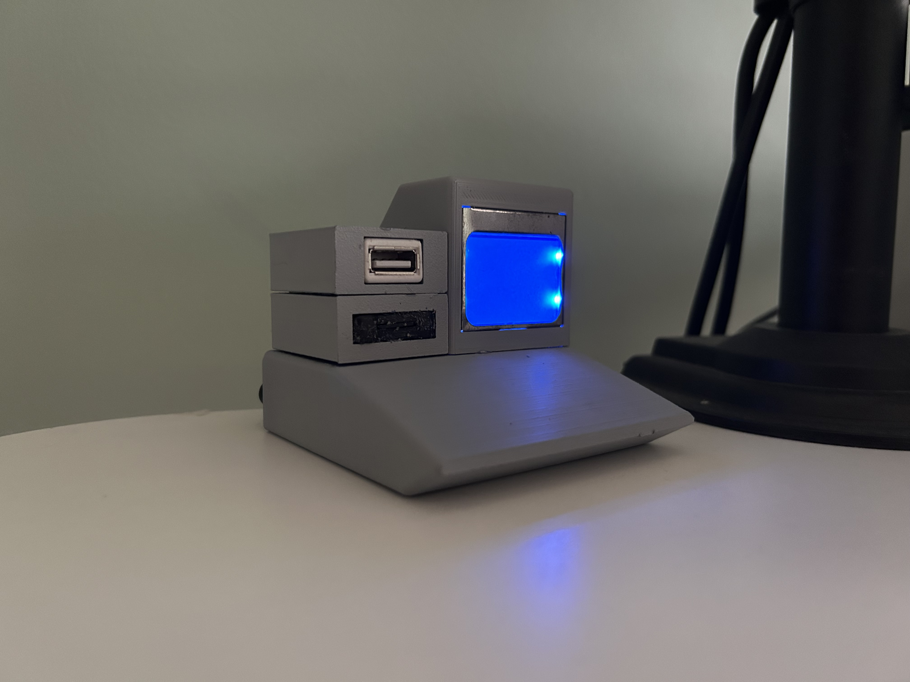
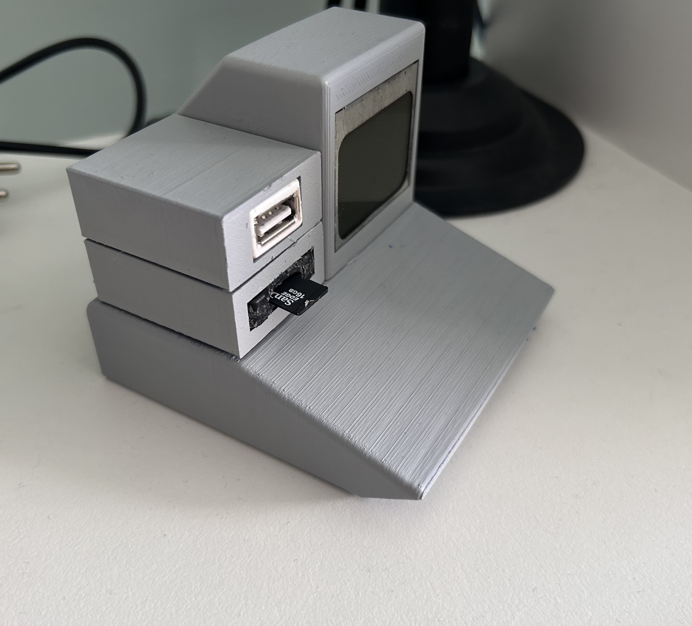

# Retro-Pi
Project aims to create a retro-style computer using a Raspberry Pi Zero. The setup includes custom hardware components, such as a 3D-printed case and 3rd party components like LCD display. 


<p align="center">
    
    
</p>


## Getting Started

To get started with the retro-pi project, follow these steps:

1. **Clone the Repository**:
    ```sh
    git clone https://github.com/yourusername/retro-pi.git
    cd retro-pi
    ```

2. **Install Dependencies**:
    Run the setup scripts to install necessary dependencies.
    ```sh
    ./setup/setup.sh
    ./setup/spi.sh
    ```

3. **Install Display Scripts**:
    Navigate to the `display` folder and run the install script.
    ```sh
    cd display
    ./install.sh
    ```

4. **3D Print the Case**:
    Use the STL files in the `hardware/CAD` folder to 3D print the case and other components.

5. **Wire the Components**:
    Follow the wiring diagram provided in the `hardware` folder to connect the LCD display and other components to the Raspberry Pi Zero.

## Usage

Once everything is set up, you can use the display scripts to interact with the LCD display. For example, to display a message:
```sh
./display/display-str "Hello, retro-pi!"
```


