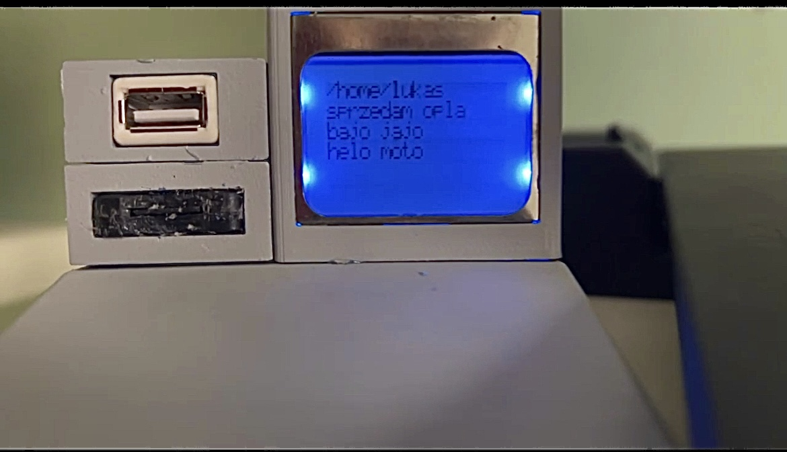
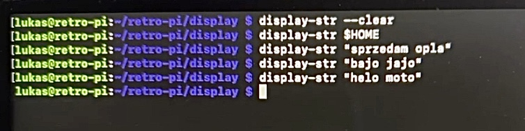

# Display

The `display` folder contains scripts and files necessary for setting up and controlling the LCD display for the retro-pi project.

## Contents

- **display.py**: The main Python script for controlling the LCD display. It includes functions for initializing the display, clearing it, setting the cursor position, and printing text.
- **display-str**: A shell script that provides a convenient way to display a string on the LCD by calling `display.py`.
- **install.sh**: A shell script to install the display scripts by copying them to `/usr/bin` and making them executable.

## Usage

### display.py

This script is used to interact with the LCD display. It can be run with a string argument to display text on the LCD.

```sh
python3 display.py "Your text here"
```

To clear the display, use the `--clear` argument:

```sh
python3 display.py --clear
```

### display-str

This script provides a simpler way to display text on the LCD. It takes a single argument, which is the text to display.

```sh
./display-str "Your text here"
```

### install.sh

Run this script to install the display scripts to `/usr/bin`.

```sh
./install.sh
```

This will copy `display-str` and `display.py` to `/usr/bin` and make them executable.

## Dependencies

```sh
pip3 install spidev RPi.GPIO pillow
```

## Wiring

Ensure that the LCD display is wired correctly to the Raspberry Pi.
See wiring diagram in the `hardware` folder for reference.



