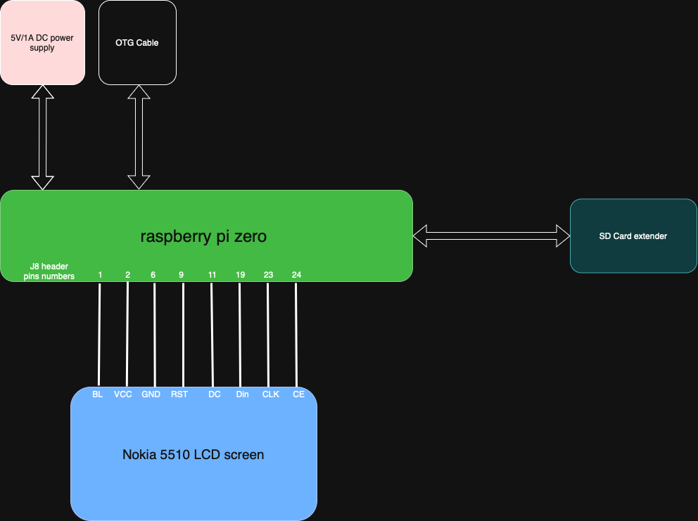

# Hardware
The CAD folder contains stl files of elements used in retro-pi computer. 
These designs are essential for ensuring that all components fit together seamlessly and function correctly.

## CAD Folder Contents

- **Case Design**: Detailed 3D models of the console case, including dimensions and assembly instructions.

## Components List
* [OTG wire](https://botland.com.pl/przejsciowki-usb/8766-przewod-otg-host-microusb-usb-15cm-oryginalny-adapter-dla-raspberry-pi-zero-5056561800820.html) 
* [SD card slot extender ](https://botland.com.pl/akcesoria-do-kart-pamieci/12250-przedluzacz-slotu-kart-microsd-48cm-5904422318925.html?cd=18298825138&ad=&kd=&gad_source=1&gbraid=0AAAAADDatXhQNuOdz_aRTWwdjid0oB9Vs&gclid=CjwKCAiA5pq-BhBuEiwAvkzVZTu67gwKWh3gbeeHPmdrcypTB_Vk4o6Oy_RuU9fl56z3Nw1DQXlLMxoCrM4QAvD_BwE)
* [nokia 5510 display](https://botland.com.pl/wyswietlacze-alfanumeryczne-i-graficzne/2650-wyswietlacz-lcd-graficzny-84x48px-nokia-5110-niebieski-5904422309299.html)
* [raspberry pi zero W](https://botland.com.pl/moduly-i-zestawy-raspberry-pi-zero/8330-raspberry-pi-zero-w-512mb-ram-wifi-bt-41-5904422311513.html)

## Wiring
